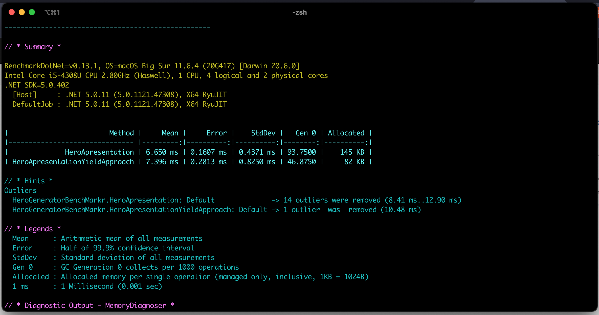

### Using Yield return

This is another example of using Yield return instead of convetionally return lists.

### Benefits

When you use `yield return` you can work each piece of data as you need it, theres no need to create the whole list on the memory, improving the application resource management and the time, GC, etc has a greater improving as you can see on the image below:

Benchmark result:

#### Observation

When you use yield return you necessarily need to return a `IEnumeral<something>` so the compiler can generate for you the Enumerable and Enumerator implementation to deal with each return of element, follows a gist of the code genereated by the compiler.

[compiler generated code example](https://gist.github.com/GusBedasi/5f4af71a0905e092d78a9356a8b6e0e4)